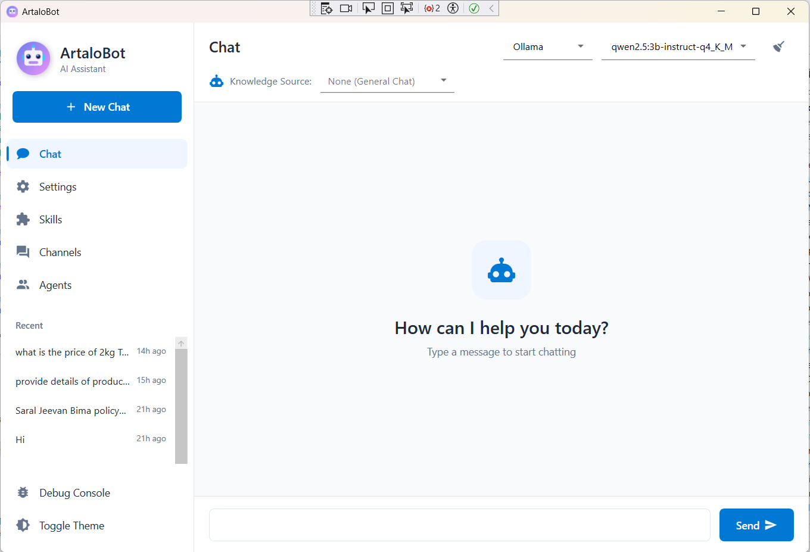
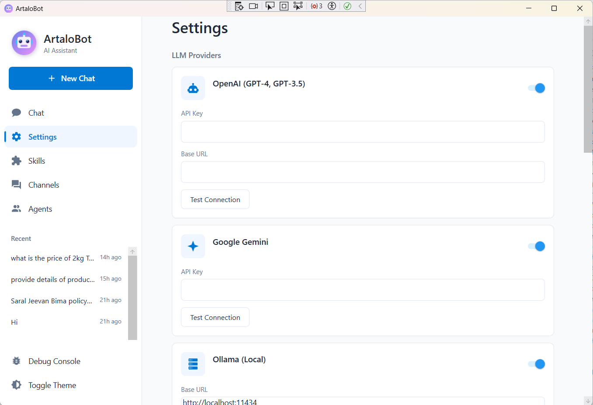
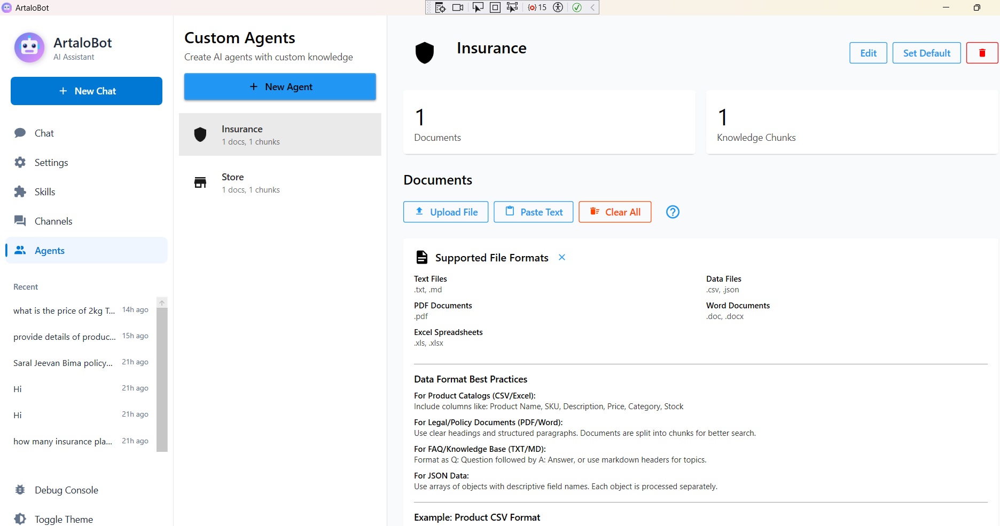
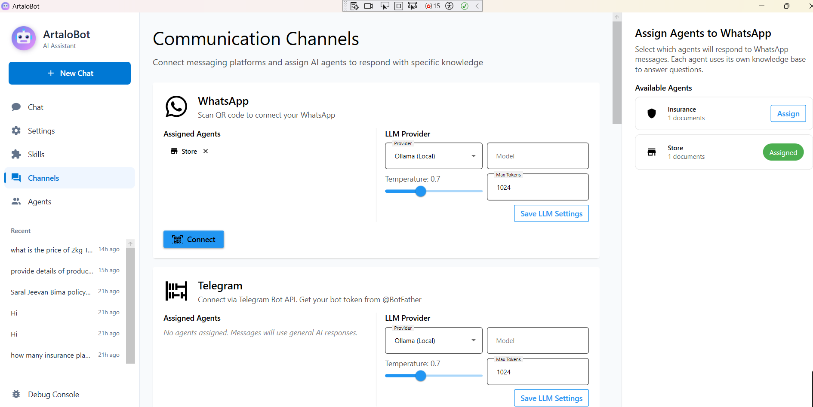
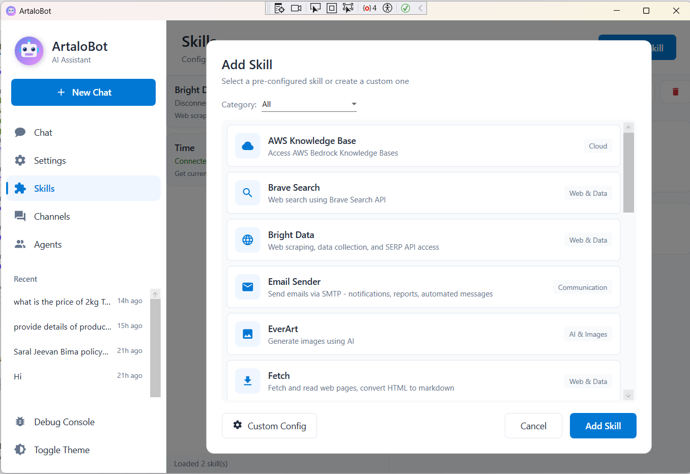
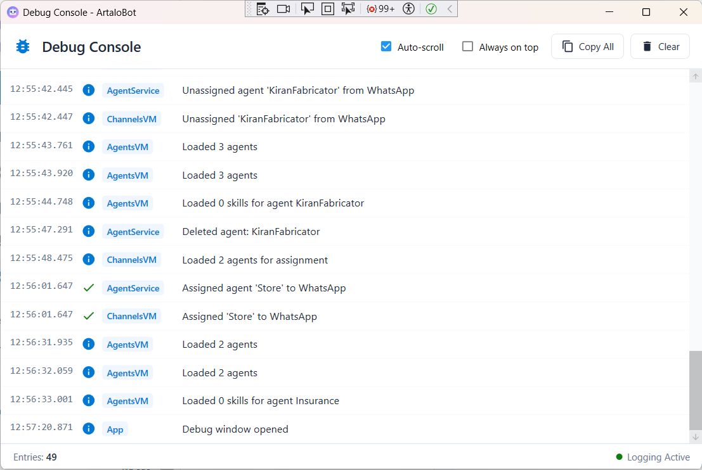

# ArtaloBot - AI Assistant Desktop Application

<p align="center">
  
</p>

<h3 align="center">Your Intelligent Multi-LLM Desktop Assistant</h3>

<p align="center">
  <strong>A powerful multi-LLM desktop application with knowledge base agents, multi-channel communication, and MCP skills support.</strong>
</p>

<p align="center">
  <a href="https://drive.google.com/file/d/12VQDY87U3sYMmMaklxu6ejkuKkDt8QDx/view?usp=sharing">
    
  </a>
</p>

<p align="center">
  
  
  
  
</p>

<p align="center">
  <a href="#features">Features</a> •
  <a href="#installation">Installation</a> •
  <a href="#quick-start">Quick Start</a> •
  <a href="#configuration">Configuration</a> •
  <a href="#usage">Usage</a> •
  <a href="#development">Development</a>
</p>

---

## Overview

ArtaloBot is a feature-rich Windows desktop application that provides a unified interface for interacting with multiple AI language models. It supports custom knowledge base agents, multi-channel messaging (WhatsApp, Telegram, Discord, Slack, and more), and extensible MCP (Model Context Protocol) skills.

---

## Screenshots

### Chat Interface
<p align="center">
  
</p>

The main chat interface features a clean, modern design with:
- **LLM Provider Selection** - Switch between Ollama, OpenAI, and Gemini
- **Model Dropdown** - Choose specific models (auto-populated for Ollama)
- **Knowledge Source** - Select agents for knowledge-based responses
- **Real-time Streaming** - Watch responses appear in real-time
- **Markdown Rendering** - Code blocks, tables, and formatting support
- **Chat History** - Access previous conversations from the sidebar

---

### Settings
<p align="center">
  
</p>

Configure your AI providers and application preferences:
- **API Keys** - Securely store OpenAI and Gemini API keys
- **Ollama Configuration** - Set custom endpoint URL
- **Default Provider** - Choose your preferred LLM provider
- **Memory Settings** - Configure long-term memory and embeddings

---

### Knowledge Agents
<p align="center">
  
</p>

Create and manage AI agents with custom knowledge bases:
- **Create Agents** - Define name, description, and system prompts
- **Document Upload** - Add PDF, DOCX, TXT, CSV, JSON, XML, MD files
- **Processing Status** - Track document chunking and embedding progress
- **Knowledge Search** - Agents use vector similarity for accurate responses

---

### Communication Channels
<p align="center">
  
</p>

Connect to multiple messaging platforms:
- **WhatsApp** - QR code authentication via Baileys
- **Telegram** - Bot API with token configuration
- **Discord** - Gateway WebSocket connection
- **Slack** - Socket Mode for real-time messaging
- **Viber, LINE, Messenger** - Additional platform support
- **Agent Assignment** - Assign knowledge agents to each channel
- **Per-Channel LLM** - Configure different providers per channel

---

### MCP Skills
<p align="center">
  
</p>

Extend AI capabilities with MCP-compatible tools:
- **Add Skills** - Connect to MCP tool servers
- **Auto-Discovery** - Automatically detect available tools
- **Built-in Skills** - Calculator, DateTime, Weather, Web Search
- **Custom Tools** - Configure command, arguments, and environment

---

### Debug Console
<p align="center">
  
</p>

Monitor and troubleshoot application activity:
- **Real-time Logs** - View API calls, responses, and errors
- **Request/Response** - Inspect LLM communication details
- **Performance Metrics** - Track response times and token usage
- **Error Tracking** - Identify and diagnose issues quickly

---

## Features

### Multi-LLM Support
- **Ollama** - Local LLM models (Llama, Mistral, Qwen, etc.)
- **OpenAI** - GPT-4o, GPT-4o-mini, GPT-3.5-turbo
- **Google Gemini** - Gemini 1.5 Pro, Gemini 1.5 Flash

### Knowledge Base Agents
- Create custom AI agents with specific knowledge domains
- Upload documents (PDF, TXT, DOCX, CSV, JSON, XML, Markdown)
- Automatic document chunking with semantic processing
- Vector similarity search using embeddings
- Assign agents to communication channels

### Multi-Channel Communication
- **WhatsApp** - QR code authentication via Baileys
- **Telegram** - Bot API integration
- **Discord** - Gateway WebSocket connection
- **Slack** - Socket Mode support
- **Viber** - Bot API (Eastern Europe, Middle East, SE Asia)
- **LINE** - Messaging API (Japan, Thailand, Taiwan, Indonesia)
- **Facebook Messenger** - Send API integration

### Per-Channel LLM Configuration
- Assign different LLM providers per channel
- Configure model, temperature, and max tokens per channel
- Use Ollama locally, or cloud providers for specific channels

### MCP Skills System
- Connect to MCP-compatible tool servers
- Auto-discovery of available tools
- Skills for weather, time, calculations, web search, and more

### Memory & Context
- Long-term memory with vector embeddings
- Session-based conversation history
- Intelligent context injection

### Modern UI
- Clean, professional Windows 11-inspired design
- Material Design components
- Markdown rendering with syntax highlighting
- Real-time streaming responses

---

## Prerequisites

### For Running Pre-built Installer
- **Operating System**: Windows 10/11 (64-bit)
- **RAM**: Minimum 4GB (8GB recommended)
- **Storage**: 500MB for application + space for models

### For Local LLM (Ollama)
- **Ollama**: Download from [ollama.ai](https://ollama.ai)
- Pull at least one model:
  ```bash
  ollama pull llama3.2
  ollama pull qwen2.5:3b
  ```

### For Cloud LLM Providers
- **OpenAI**: API key from [platform.openai.com](https://platform.openai.com)
- **Google Gemini**: API key from [ai.google.dev](https://ai.google.dev)

### For WhatsApp Integration
- **Node.js**: Version 18+ from [nodejs.org](https://nodejs.org)

---

## Installation

### Option 1: Download Pre-built Installer (Recommended)

<p align="center">
  <a href="https://drive.google.com/file/d/12VQDY87U3sYMmMaklxu6ejkuKkDt8QDx/view?usp=sharing">
    <strong>Download ArtaloBot Installer (Google Drive)</strong>
  </a>
</p>

1. Download `ArtaloBot-Setup.exe` from the link above
2. Run the installer
3. Follow the installation wizard
4. Launch ArtaloBot from the Start Menu or Desktop shortcut

### Option 2: Portable Version

1. Download `ArtaloBot-Portable.zip` from [Releases](https://github.com/anuragstpl/ArtaloAgent/releases)
2. Extract to your desired location
3. Run `ArtaloBot.App.exe`

### Option 3: Build from Source

#### Prerequisites for Building
- **.NET 8 SDK**: Download from [dotnet.microsoft.com](https://dotnet.microsoft.com/download/dotnet/8.0)
- **Visual Studio 2022** (optional) or **VS Code** with C# extension
- **Git**: For cloning the repository

#### Build Steps

```bash
# Clone the repository
git clone https://github.com/your-repo/artalobot.git
cd artalobot

# Restore dependencies
dotnet restore

# Build the solution
dotnet build

# Run the application
dotnet run --project src/ArtaloBot.App
```

#### Create Installer/Portable Package

```bash
# Publish self-contained single-file executable
dotnet publish src/ArtaloBot.App -c Release -r win-x64 --self-contained true -p:PublishSingleFile=true -p:EnableCompressionInSingleFile=true -o ./publish

# The executable will be at ./publish/ArtaloBot.App.exe
```

---

## Quick Start

### 1. First Launch
When you first launch ArtaloBot, it will:
- Create a local SQLite database for storing settings and chat history
- Initialize the embedding service for memory features
- Auto-connect any configured MCP skills

### 2. Configure Ollama (Recommended)
1. Install Ollama from [ollama.ai](https://ollama.ai)
2. Pull a model: `ollama pull qwen2.5:3b`
3. Ensure Ollama is running (default: http://localhost:11434)
4. ArtaloBot will automatically detect available models

### 3. Start Chatting
1. Click **New Chat** or select the **Chat** tab
2. Choose your LLM provider and model from the dropdowns
3. Type your message and press Enter or click Send

### 4. Set Up Knowledge Agents (Optional)
1. Go to **Agents** tab
2. Click **Create Agent**
3. Give it a name and description
4. Upload documents (PDF, TXT, DOCX, etc.)
5. Wait for processing to complete
6. Select the agent in Chat to use its knowledge

### 5. Connect Communication Channels (Optional)
1. Go to **Channels** tab
2. Select a channel (WhatsApp, Telegram, etc.)
3. Enter required credentials (API tokens)
4. Click **Connect**
5. Assign agents to the channel for knowledge-based responses

---

## Configuration

### API Keys

Navigate to **Settings** to configure API keys:

| Provider | Required Keys | Where to Get |
|----------|---------------|--------------|
| OpenAI | API Key | [platform.openai.com/api-keys](https://platform.openai.com/api-keys) |
| Gemini | API Key | [ai.google.dev](https://ai.google.dev) |
| Ollama | None | Runs locally |

### Channel Configuration

| Channel | Required | How to Obtain |
|---------|----------|---------------|
| WhatsApp | QR Scan | Scan with WhatsApp mobile app |
| Telegram | Bot Token | Create bot via [@BotFather](https://t.me/botfather) |
| Discord | Bot Token | [Discord Developer Portal](https://discord.com/developers) |
| Slack | Bot Token + App Token | [Slack API Apps](https://api.slack.com/apps) |
| Viber | Auth Token | [Viber Admin Panel](https://partners.viber.com/) |
| LINE | Channel Access Token | [LINE Developers](https://developers.line.biz/) |
| Messenger | Page Access Token | [Meta Developer Portal](https://developers.facebook.com/) |

### Memory Settings

Configure in **Settings** > **Memory**:
- **Enable/Disable** long-term memory
- **Embedding Model** (default: nomic-embed-text via Ollama)
- **Similarity Threshold** for memory retrieval
- **Max Memories** to inject per query

---

## Usage

### Chat Interface

- **Provider Selection**: Choose between Ollama, OpenAI, or Gemini
- **Model Selection**: Select specific model (for Ollama)
- **Knowledge Source**: Select an agent for knowledge-based responses
- **Send**: Press Enter (with debounce) or Shift+Enter (immediate)
- **Stop**: Click Stop to cancel streaming response

### Creating Agents

1. **Name**: Give your agent a descriptive name
2. **Description**: Describe what knowledge it contains
3. **System Prompt**: Custom instructions for the agent
4. **Documents**: Upload files to build the knowledge base
   - Supported: PDF, TXT, DOCX, CSV, JSON, XML, MD
   - Documents are automatically chunked and embedded

### Channel Integration

1. **Connect**: Authenticate with the messaging platform
2. **Assign Agents**: Select which agents respond to channel messages
3. **Configure LLM**: Choose provider/model per channel
4. **Test**: Send a message to verify the integration

### MCP Skills

1. Go to **Skills** tab
2. Click **Add Skill**
3. Configure the MCP server:
   - **Command**: Path to the MCP server executable
   - **Arguments**: Command-line arguments
   - **Environment**: Required environment variables
4. Click **Connect** to discover available tools

---

## Project Structure

```
ArtaloBot/
├── src/
│   ├── ArtaloBot.App/           # WPF Application
│   │   ├── Views/               # XAML Views
│   │   ├── ViewModels/          # MVVM ViewModels
│   │   ├── Controls/            # Custom Controls
│   │   ├── Converters/          # Value Converters
│   │   ├── Resources/           # Styles, Themes
│   │   └── Services/            # App Services
│   │
│   ├── ArtaloBot.Core/          # Core Business Logic
│   │   ├── Models/              # Domain Models
│   │   ├── Interfaces/          # Service Interfaces
│   │   └── Events/              # Event Definitions
│   │
│   ├── ArtaloBot.Services/      # Service Implementations
│   │   ├── LLM/                 # LLM Providers
│   │   ├── Channels/            # Messaging Channels
│   │   ├── Agents/              # Agent & Document Processing
│   │   ├── MCP/                 # MCP Client
│   │   ├── Memory/              # Vector Memory
│   │   └── Skills/              # Built-in Skills
│   │
│   └── ArtaloBot.Data/          # Data Layer
│       ├── AppDbContext.cs      # EF Core Context
│       └── Repositories/        # Data Repositories
│
├── publish/                     # Published executables
├── docs/                        # Documentation
└── README.md                    # This file
```

---

## Technology Stack

| Component | Technology |
|-----------|------------|
| Framework | .NET 8, WPF |
| Architecture | MVVM with CommunityToolkit.Mvvm |
| UI | MaterialDesignInXAML |
| Database | SQLite with Entity Framework Core |
| HTTP | HttpClientFactory with Polly resilience |
| Markdown | Markdig with WPF rendering |
| Vector Search | Cosine similarity on embeddings |

---

## Troubleshooting

### Ollama Not Connecting
```bash
# Ensure Ollama is running
ollama serve

# Check if models are available
ollama list

# Pull a model if needed
ollama pull qwen2.5:3b
```

### WhatsApp Connection Issues
- Ensure Node.js 18+ is installed
- Check that the WhatsApp bridge server starts correctly
- Try refreshing the QR code

### Memory/Embedding Errors
- Ensure Ollama is running with an embedding model
- Pull the embedding model: `ollama pull nomic-embed-text`

### Application Crashes on Startup
- Check if .NET 8 Desktop Runtime is installed
- Try running as Administrator
- Check Windows Event Viewer for detailed error logs

---

## Future Development

### Planned Features

- [ ] **Voice Input/Output** - Speech-to-text and text-to-speech
- [ ] **Image Generation** - DALL-E and Stable Diffusion integration
- [ ] **Code Execution** - Sandboxed code runner skill
- [ ] **Microsoft Teams** - Teams channel integration
- [ ] **Plugin System** - User-installable plugins
- [ ] **Multi-language UI** - Localization support
- [ ] **Cloud Sync** - Sync settings and agents across devices
- [ ] **Scheduled Tasks** - Automated agent responses
- [ ] **Analytics Dashboard** - Usage statistics and insights
- [ ] **RAG Improvements** - Hybrid search, re-ranking

### Contribution Guidelines

1. Fork the repository
2. Create a feature branch: `git checkout -b feature/my-feature`
3. Commit changes: `git commit -am 'Add my feature'`
4. Push to branch: `git push origin feature/my-feature`
5. Submit a Pull Request

---

## License

This project is licensed under the MIT License - see the [LICENSE](LICENSE) file for details.

---

## Acknowledgments

- [Ollama](https://ollama.ai) - Local LLM runtime
- [MaterialDesignInXAML](https://github.com/MaterialDesignInXAML/MaterialDesignInXamlToolkit) - UI components
- [CommunityToolkit.Mvvm](https://github.com/CommunityToolkit/dotnet) - MVVM framework
- [Markdig](https://github.com/xoofx/markdig) - Markdown processing
- [Baileys](https://github.com/WhiskeySockets/Baileys) - WhatsApp Web API

---

## Support

- **Issues**: [GitHub Issues](https://github.com/your-repo/artalobot/issues)
- **Discussions**: [GitHub Discussions](https://github.com/your-repo/artalobot/discussions)

---

<p align="center">
  Made with ❤️ by the ArtaloBot Team
</p>
